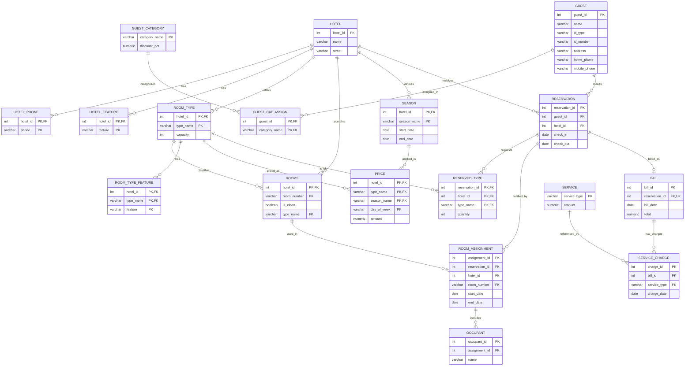

# CS374 Hotel Database HW8 Report
Francesco Benedetto and Cameron Hakenson

## ER Model

Static export (HW7 Chen-style diagram, retained for reference):
- 

Changes since HW7:
- Added a `service` table to store service type and amount in one place.
- Updated `service_charge` to reference `service(service_type)` instead of storing amount directly in each charge row.
- Replaced the static EER export with a Mermaid `erDiagram` so the diagram is text-versioned alongside the schema. Three issues from the Chen-style PNG are corrected here: `SEASON.start_date` is now shown, the stray `GUEST./type` attribute is removed, and the missing `GUEST ─ makes ─ RESERVATION` relationship is now explicit.

## Relational Model
- 

Changes since HW7:
- Added relation `service(service_type, amount)`.
- Preserved all existing table/file structure while extending billing-related schema.

## Database creation
- Create tables (no foreign keys): [00_create_tables_no_fks.sql](./database/00_create_tables_no_fks.sql)
- Add foreign keys: [00_add_foreign_keys.sql](./database/00_add_foreign_keys.sql)
- Drop foreign keys: [00_drop_foreign_keys.sql](./database/00_drop_foreign_keys.sql)
- Seed data: [01_seed_data.sql](./data/01_seed_data.sql)

Schema/index notes:
- Added index `idx_reservation_hotel_dates` on `reservation(hotel_id, check_in, check_out)`.
- Added index `idx_room_assignment_room_dates` on `room_assignment(hotel_id, room_number, start_date, end_date)`.
- Reasoning:
  - Query Set 1 and Query 5 use date-range filtering/overlap logic on reservations.
  - Query Set 2 and Query 4 repeatedly check occupancy by room and date.
  - These indexes reduce full table scans on reservation/assignment date lookups.

## Data setup for query testing
Additional data was inserted in `01_seed_data.sql` to fully test the assignment requirements:
- Added `vip` category and mapped a test guest to that category.
- Added reservations and room assignments so at least one requested room type is unavailable.
- Added a Hotel B reservation for Mrs. Smith and an overlapping occupied double room.
- Added room type features for billing statement output.
- Added multi-hotel billed stays for one guest (John Smith) to test one-year chain spending.

## Queries

### Query Set 1: Reservations
Code:
- [query1_reservations.sql](./queries/query1_reservations.sql)

Scenario used:
- New VIP guest request in **Hotel A** for **2026-07-15 to 2026-07-17**.

What the SQL does:
- Select query:
  - Computes all nights in stay (2 nights).
  - Applies season/day-of-week room prices.
  - Applies category discount for VIP.
  - Returns available room types only, plus average nightly price.
- Insert queries (inside a transaction):
  - Inserts new guest.
  - Inserts VIP category assignment.
  - Inserts reservation and reserved room type.

How requirements are satisfied:
- At least one room type is unavailable due to seeded overlap reservation.
- Price varies across the two nights by day-of-week.
- Customer category changes overall price through discount logic.

Screenshots:

Pre-state (existing Hotel A reservations overlapping 2026-07-15 to 2026-07-17 — `suite` is fully booked by reservation 1013):

Availability + VIP-discounted average nightly cost (only `double` is available; $132.00 average with the 20% VIP discount applied to Wed/Thu summer rates):

Insert transaction (new VIP guest 1200 and reservation 2200 inside `BEGIN`/`COMMIT`):

Post-state (new guest, category assignment, reservation, and reserved type rows):

### Query Set 2: Checking In
Code:
- [query2_checking_in.sql](./queries/query2_checking_in.sql)

Scenario used:
- **Mrs. Smith** arrives at **Hotel B** for existing reservation `1020` (double room).

What the SQL does:
- Select query:
  - Lists unoccupied double rooms matching reservation hotel/type on check-in date.
  - Excludes currently occupied rooms via `NOT EXISTS` over `room_assignment`.
- Insert queries (inside a transaction):
  - Assigns a room to reservation `1020`.
  - Inserts occupants including Mr. Smith (new occupant record).

How requirements are satisfied:
- Reservation already exists before check-in query.
- At least one double room is occupied and not returned by availability select.

Screenshots:

Pre-state (Mrs. Smith's existing reservation 1020 in Hotel B, plus room 101 already occupied by reservation 1021):

Available double rooms for reservation 1020 (rooms 102 and 103 — room 101 correctly excluded):

Insert transaction (assigns room 102 and inserts both Mary Smith and Mr. Smith as occupants):

Post-state (room assignment 5300 and two new occupant rows):

### Query Set 3: Checking Out
Code:
- [query3_checking_out.sql](./queries/query3_checking_out.sql)

Scenario used:
- After two nights, Smith reservation `1020` checks out.

What the SQL does:
- Insert/update transaction:
  - Inserts extra service (`minibar`) and service charge.
  - Inserts bill row if missing.
  - Updates room assignment end date to checkout date.
  - Recomputes and updates bill total from:
    - nightly room charges by day-of-week/season/category discount
    - plus service charges
- Final select:
  - Returns reserver, stay date range, room type, room features, and total cost.

How requirements are satisfied:
- Reservation is fully in one season.
- Room cost varies by day-of-week.
- Guest category affects room pricing.
- Checkout and billing history are recorded.

Screenshots:

Pre-state (no bill or `minibar` service yet, room assignment exists from Query Set 2):

Checkout transaction (inserts service, bill, charge; updates assignment and recomputes bill total):

Billing statement (Mary Smith, 2026-07-15 to 2026-07-17, double, room features, total $315.50 — gold 15% discount on $160 + $170 plus a $35 minibar charge):

Post-state (bill 7300 with computed total, `minibar` service row, service charge, and assignment with checkout date):

### Query 4: Find the occupants
Code:
- [query4_find_occupants.sql](./queries/query4_find_occupants.sql)

Scenario used:
- Lookup for **Hotel B**, room **102**, date **2026-07-16**.

What the SQL does:
- Returns the reserver name and all occupant names for that room/date.
- Uses `UNION` of reserver lookup and occupant lookup.

How requirements are satisfied:
- Returns at least two names (reserver + at least one occupant).

Screenshots:

Pre-state (room 102 in Hotel B on 2026-07-16: assignment 5300 with reserver Mary Smith, plus the two seeded occupant rows):

Query result (reserver Mary Smith plus both occupants, satisfying the "at least 2 people" requirement):

### Query 5: Total spending over a year
Code:
- [query5_total_spending_year.sql](./queries/query5_total_spending_year.sql)

Scenario used:
- Guest **John Smith**, period **2026-01-01 to 2027-01-01**.

What the SQL does:
- Sums billed totals across the chain for that one-year period.
- Enforces requirements with `HAVING`:
  - at least 2 reservations
  - in at least 2 distinct hotels

How requirements are satisfied:
- Seeded billing data includes qualifying reservations in multiple hotels.

Screenshots:

Pre-state (John Smith's two qualifying reservations — Hotel A bill $380, Hotel B bill $310 — both in 2026):

Query result (total chain spending of $690.00, with `HAVING` confirming 2 reservations across 2 distinct hotels):

## Transaction usage
Transactions are used for all insert/update workflows that should execute atomically:
- Query Set 1 insert workflow.
- Query Set 2 check-in workflow.
- Query Set 3 checkout and billing workflow.